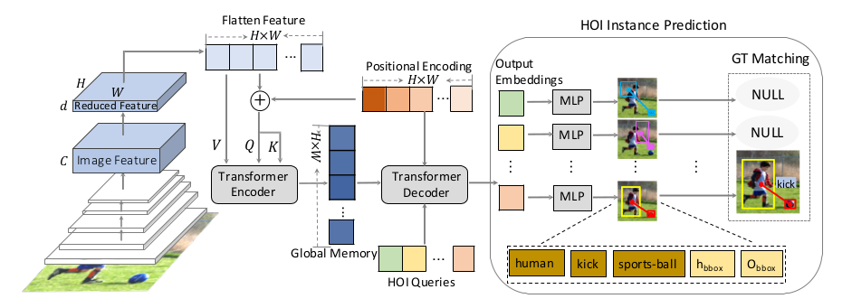

# HOI Transformer
Code for CVPR 2021 accepted paper [End-to-End Human Object Interaction Detection with HOI Transformer](https://arxiv.org/abs/2103.04503).

<div align="center">
  
</div>


## Reproduction

We recomend you to setup in the following steps:

1.Clone the repo.
```
git clone https://github.com/bbepoch/HoiTransformer.git
```

2.Download the MS-COCO pretrained [DETR](https://github.com/facebookresearch/detr) model.
```bash
cd data/detr_coco && bash download_model.sh
```

3.You are supposed to make a soft link named 'images' in 'data/hico/' to refer to your [HICO-DET](https://drive.google.com/open?id=1QZcJmGVlF9f4h-XLWe9Gkmnmj2z1gSnk) path, or your will have to modify the data path manually in [hico.py](datasets/hico.py).
```
ln -s /path-to-your-hico-det-dataset/hico_20160224_det/images images
```

4.Train a model.
```
python3 -m torch.distributed.launch --nproc_per_node=8 --use_env main.py --epochs=250 --lr_drop=200 --dataset_file=hico --batch_size=2 --backbone=resnet50
```

5.Prepare evaluation tool.
```
cd data/hico && unzip eval.zip
```

6.Test a [model](https://drive.google.com/drive/folders/1RY_4rrUuFzlTfFp5IVTNauB0-Sd0fphW?usp=sharing).
```
python3 test.py --dataset_file=hico --batch_size=1 --log_dir=./ --backbone=resnet50 --model_path=your_model_path
```


## Citation
```
@inproceedings{zou2021_hoitrans,
  author = {Zou, Cheng and Wang, Bohan and Hu, Yue and Liu, Junqi and Wu, Qian and Zhao, Yu and Li, Boxun and Zhang, Chenguang and Zhang, Chi and Wei, Yichen and Sun, Jian},
  title = {End-to-End Human Object Interaction Detection with HOI Transformer},
  booktitle={CVPR},
  year = {2021},
}
```


## Acknowledgement
We sincerely thank all previous works, especially [DETR](https://github.com/facebookresearch/detr), [PPDM](https://github.com/YueLiao/PPDM), [iCAN](https://github.com/vt-vl-lab/iCAN), for some of the codes are built upon them.

